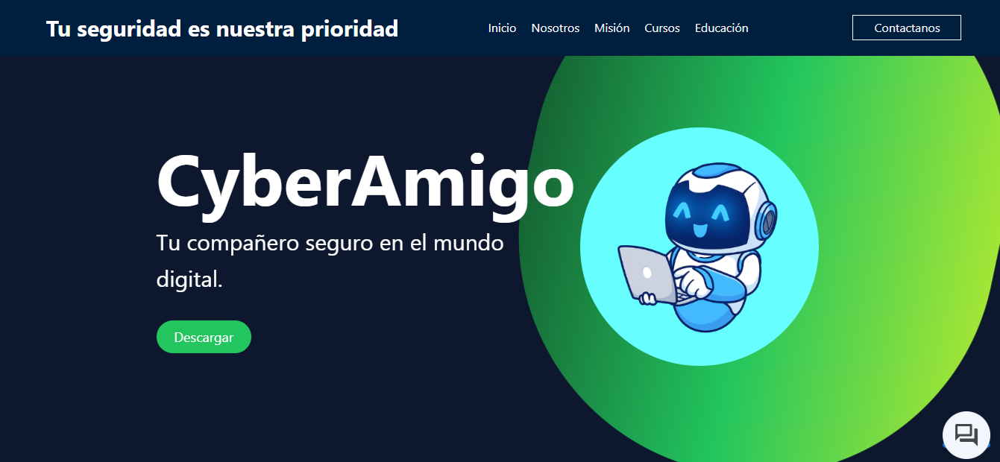
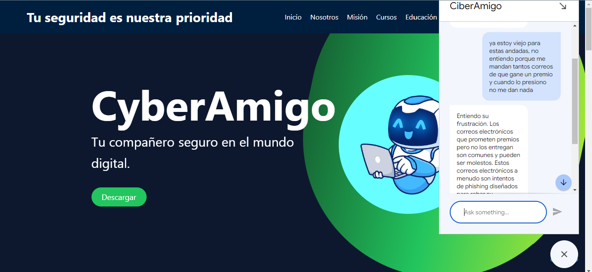

# CiberAmigo - Asistente de Ciberseguridad para Adultos Mayores



CiberAmigo es una aplicación web diseñada para ayudar a los adultos mayores a identificar y prevenir ciberataques y riesgos en su red. Utiliza inteligencia artificial para monitorear la actividad de red, correos electrónicos y redes sociales en busca de señales de actividades sospechosas, alertando a los usuarios de posibles amenazas. Además, integra un chatbot que brinda recomendaciones de seguridad y respuestas a las dudas del usuario, con un enfoque en accesibilidad y simplicidad.

## Características

- **Monitoreo de Red**: Detecta patrones de tráfico sospechoso en HTTP, HTTPS y SSH, así como posibles ataques de ping.
- **Análisis de Correos Electrónicos**: Escanea correos electrónicos entrantes en busca de enlaces o contenido sospechoso y genera alertas.
- **Asistente de Seguridad**: Un chatbot que responde a las dudas del usuario, proporcionando recomendaciones de seguridad de manera accesible.
- **Alertas por Correo Electrónico**: Envía notificaciones al usuario sobre actividades sospechosas detectadas, incluyendo un enlace para obtener más información y abrir el chatbot.



## Tecnologías Utilizadas

- **Frontend**: React, Dialogflow Messenger
- **Backend/Monitorización**: Python, Scapy, IMAP, smtplib
- **Cloud**: Azure para la implementación del servidor de monitoreo y el frontend en producción
- **Configuración de Seguridad**: Dotenv para la gestión de variables de entorno sensibles

## Configuración e Instalación

### Prerrequisitos

1. Tener una cuenta de **Google Cloud** y configurar **Dialogflow Agent** para el chatbot.
2. Tener una cuenta de **Azure** para desplegar el servidor de monitoreo y el frontend.
3. Instalar **Python 3.8 o superior** y las siguientes librerías:
    - `scapy`
    - `dotenv`
    - `smtplib`
    - `imaplib`
  
### Paso 1: Configuración de Variables de Entorno

Crea un archivo `.env` en la raíz del proyecto con las siguientes variables:

```plaintext
USER="tu_correo@gmail.com"  # Correo del remitente
PASS="tu_contraseña_de_aplicación"  # Contraseña de aplicación generada en Google
```

### Paso 2: Iniciar el Servidor de Monitoreo

1. En tu máquina virtual de Azure, sube los scripts de monitoreo (main.py y analisis_correo.py).
2. Ejecuta el script principal de monitoreo en segundo plano:

```plaintext
sudo -E python3 main.py
```

### Paso 3: Configuración del Frontend

Clona el repositorio en tu máquina local:
```plaintext
git clone https://github.com/Alangh0011/Hackmx-Google.git
```
```plaintext
npm install
```
Configura el archivo de Dialogflow Messenger en el componente Chatbot.js con las credenciales del agente.
Ejecuta el frontend en modo de desarrollo:
```plaintext
npm run dev
```

### Paso 4: Uso de la Aplicación

Monitoreo Automático: El script de monitoreo ejecutará automáticamente un análisis de red y correos electrónicos.
Alertas por Correo: Cuando se detecte actividad sospechosa, se enviará un correo al usuario con un resumen de la amenaza y un botón para "Más información".
Chatbot: Al hacer clic en "Más información", se abrirá el chatbot con un mensaje inicial predefinido, donde el usuario podrá recibir recomendaciones personalizadas.


### Contribuciones
¡Las contribuciones son bienvenidas! Si deseas mejorar el proyecto, abre un pull request o crea un issue en el repositorio.

### Contacto


